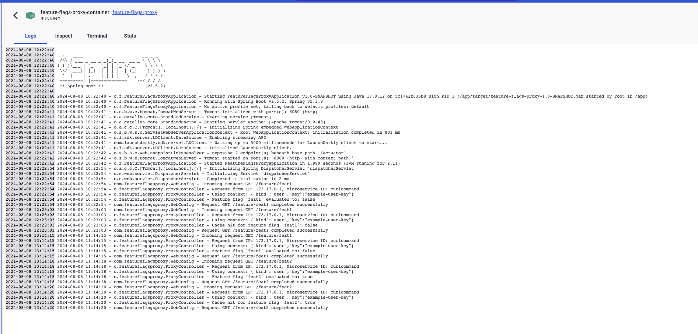

...a reverse proxy that acts as an intermediary between your apps and the API of your Feature Flag SaaS Tool, reducing costs by centralizing feature flag evaluations and avoiding vendor lock-in.

# Feature Flags Proxy
  
- **Feature Flag Evaluation**: Exposes an endpoint to check the status of a feature flag.
  - Example: `curl "http://localhost:8080/feature/feat1?microserviceId=curlcommand"`
  - Response: Returns `True` or `False` based on the feature flag status for the feature nammed `feat1` on your feature flag tool (unleash, launchdarkly etc).

- **Vendor Lock-in Avoidance**: This project abstracts the feature flag evaluation logic through a proxy, making it easier to switch between feature flag tools (e.g., from Unleash to another service) without making significant changes to your underlying codebase. This helps prevent vendor lock-in and provides flexibility in choosing or changing feature flag providers.

- **Caching**: Implements a caching layer for feature flag results with a default Time-to-Live (TTL) of 2 minutes, configurable via environment variables.

- **Logging**: Logs request details including:
  - The IP address of the requestor.
  - Custom source information (e.g., label `myapp-prod`) passed through the request for traceability.

- **Context Support (In Progress)**: Planned support for passing user-specific data (contexts) to the underlying feature flag tool. This will be crucial for enabling A/B testing, as it allows the flag status to differ based on the user or client context.

- **Stack**: Built in Java and Dockerized, self-hostable

## Commands to run and test the app locally

  ```bash
docker build -t feature-flags-proxy .
docker run --rm -d -p 8080:8080 \
    -e LAUNCHDARKLY_SDK_KEY="sdk-XXXX" \
    -e CACHE_TTL_MINUTES=1 \
    --name feature-flags-proxy-container \
    feature-flags-proxy
curl "http://localhost:8080/feature/feat1?microserviceId=curlcommand"
curl -f http://localhost:8080/actuator/health
  ```

## TODO
Can be considered as production ready, but here is a todo of improvements:

- [ ] Implement multi-context support for A/B testing (allow different flag states based on user data). The best way to implement this seems to be by passing a JSON payload to the reverse proxy that contains the relevant data.
- [ ] Implement the SDK of your given feature flagging SaaS tool!
- [ ] Implement CI/CD pipelines for Docker image building and deployment.
- [ ] Optimize caching mechanism? (event-driven cache invalidation, distributed caching, fine-grained caching strategy, LRU?, LFU?)
- [ ] Improve logging and tracing.s
- [ ] High availabilty 
- [ ] IP rotation - proxy pooling
- [ ] Throttle requests
- [ ] Randomizing headers and user contexts for each request
- [ ] Improve security posture (docker, TLS etc)

## Screenshot

